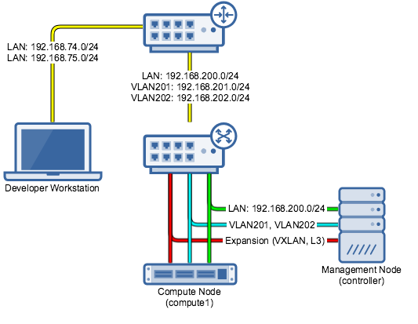

# openstack-chef-repo
Derived from: https://github.com/openstack/openstack-chef-repo

This project uses `rake` to execute `chef-client` in solo mode to install openstack components on multiple nodes. We heavily leverage the official openstack cookbooks [`openstack/cookbook-openstack-*`](https://github.com/openstack?q=cookbook-openstack-) to do the hard work. We encapsulate the configuration of the entire openstack system in [`environments/corista-openstack.json`](environments/corista-openstack.json). We describe our nodes and override necessary configuration in [`roles/`](roles).

> **NOTE!**: `environment.override_attributes` overrides `role.override_attributes`, so care must be taken when setting attributes in the environment file

We use [`sites-cookbooks/corista-openstack`](site-cookbooks/corista-openstack) to patch things in the existing [`openstack/cookbook-openstack-*`](https://github.com/openstack?q=cookbook-openstack-) cookbooks or add functionality.

# Architecture
Currently we operate two nodes, a [controller](roles/corista-openstack-controller.json) node and a [compute1](roles/corista-openstack-compute1.json) node. We are using a VLAN provider network configuration. This diagram shows the physical hardware connections as well as the networks on each cable.



## Router
The router has the following LANS/VLANs configured.

| Router Port |      Subnet      | DHCP? |                                                                   Notes                                                                   |
|:-----------:|:----------------:|:-----:|:-----------------------------------------------------------------------------------------------------------------------------------------:|
|     eth2    | 192.168.200.0/24 |  Yes  | This functions as the Openstack Management Network. All physical nodes of the Openstack Cluster have a static IP on this network.         |
|   eth2.201  | 192.168.201.0/24 |  Yes* | This functions at the Openstack VLAN Provider Network. All VMs will get an IP on this network. *DHCP is run by Openstack, not the router. |
|   eth2.202  | 192.168.202.0/24 |   No  | This network is for expansion if 201 fills up.                                                                                            |

## Switch
The switch is configured with all ports `Untagged` for `VLAN1` and `Tagged` for `VLAN201` and `VLAN202`.

## Machines
The machines have the following interfaces configured.

|    Node    | Interface |  IPv4 Address  | Bridge Ports |                   Notes                  |
|:----------:|:---------:|:--------------:|--------------|:----------------------------------------:|
| controller |   enp4s0  |                |              | Management Network Physical Interface    |
| controller |   enp3s0  |                |              | VLAN Provider Network Physical Interface |
| controller |   enp5s0  |                |              | Expansion (VXLAN, L3)                    |
| controller |  br-mgmt  | 192.168.200.10 |    enp4s0    | Management Network Bridge                |
| controller |  br-vlan  |                |    enp3s0    | VLAN Provider Network Bridge             |
|            |           |                |              |                                          |
|  compute1  |    eno1   |                |              | Management Network Physical Interface    |
|  compute1  |    eno2   |                |              | VLAN Provider Network Physical Interface |
|  compute1  |    eno3   |                |              | Expansion (VXLAN, L3)                    |
|  compute1  |  br-mgmt  | 192.168.200.30 |     eno1     | Management Network Bridge                |
|  compute1  |  br-vlan  |                |     eno2     | VLAN Provider Network Bridge             |

# Install and Configure Nodes
On each node from a local terminal run the following commands.

## Prerequisites
`compute` and `controller` nodes must have a fresh install of Ubuntu 16.04 server and a default user named `corista`.

```sh
# become `root` so you can break the system.
sudo -s

# install git
apt install -y git

# git this repo
mkdir -p /opt/corista
cd /opt/corista
git clone git@github.com:ErikDahlinghaus/openstack-chef-repo.git
cd openstack-chef-repo

# install chefdk
./install_chefdk.sh

# vendor the cookbooks
# * downloads all the cookbooks from the Berksfile and puts them in cookbooks/
chef exec berks_vendor

# check which tasks are available to build
chef exec rake -T

# choose the appropriate task
# if this were the controller node
#chef exec rake controller:install

# if this were the compute1 node
#chef exec rake compute1:install
```

> **NOTE**: After chef runs successfully, the instances can be accessed via SSH with username `corista` and private key `.chef/openstack_cluster.pem`.


# Manual Configuration Steps
Perform these steps on the `controller` node after the install is complete. This will configure the openstack cluster for use using the openstack API through the `openstack` CLI.

## Projects, Groups, Roles, and Users
First we create our default project where we will spawn most of our instances. Then we create a `developers` group which we will add regular users to. We create a role `developer` which can be assigned to things in the future. We associate the `developers` group with the `developer` and `admin` roles and the `corista` project. Now any user added to the `developers` group will become an admin on the `corista` project. Follow the steps below in order from the `controller` node.

```sh
sudo -s

# source credentials for openstack client
source /root/openrc

# create corista project
openstack project create --or-show --enable --description "default corista project" corista

# create developers group
openstack group create --or-show --description "developers developers" developers

# add developer role (currently associated with nothing)
openstack role create --or-show developer

# associate developer role with developer group for the corista project
openstack role add --project corista --group developers developer

# associate admin role with developer group for the corista project
# * gives anyone in the developers group admin privileges on the corista project
openstack role add --project corista --group developers admin

# add the corista user, associated with the corista project
openstack user create --or-show --project corista --description "default corista user" corista

# add the corista user to the developers group
openstack group add user developers corista

# add other users and associate them with the developers group
export USER=syang
# add the $USER user, associated with the corista project
openstack user create --or-show --project corista $USER
# add the $USER user to the developers group
openstack group add user developers $USER
```

## Networks
__in progress__

# Developing
Have a look at [`openstack/openstack-chef-repo/doc/databags.md`](https://github.com/openstack/openstack-chef-repo/blob/master/doc/databags.md), [`.chef/knife.rb`](.chef/knife.rb), [`Berksfile`](Berksfile), [`Rakefile`](Rakefile), and [`site-cookbooks/corista-openstack`](site-cookbooks/corista-openstack).
